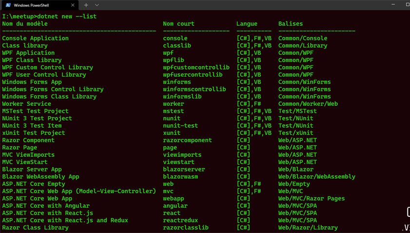
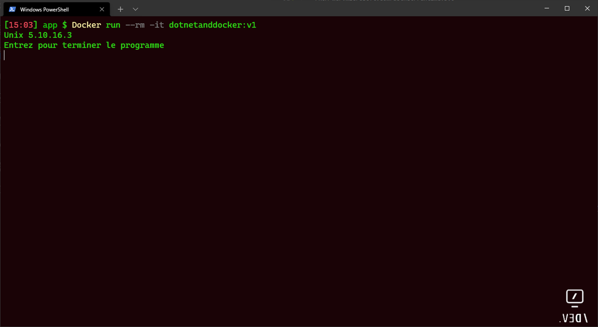
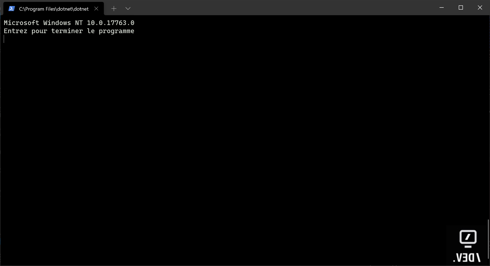

Démonstration simplifiée de l'utilisation de **.NET 5** de la containeurisation avec **docker** (containers Windows et Linux) et d'intégration continue d'une application Console avec **Github Action**

* [Préparation du poste de developpement Windows 10](Préparation-du-poste-de-developpement-(Windows-10))
* [Abonnement Azure et Github](#Abonnement-Azure-et-Github)
* [Création d'une application console .NET 5](#Création-d'une-application-console-.NET-5)    
* [Containeurisation d'une application console .NET 5](#Containeurisation-d'une-application-console-.NET-5)
    * [Création d'un container Linux](#-Création-d'un-container-Linux)
    * [Création d'un container Windows](#-Création-d'un-container-Windows)
    * [Se connecter à un container](#Se-connecter-à-un-container)
* [Automatiser le déploiement avec Github Action](#Automatiser-le-déploiement-avec-Github-Action)
    * [Etape d'intégration continue (CI)](#Etape-d'intégration-continue-(CI))
    * [Etape de déploiement continue (CD)](#Etape-de-déploiement-continue-(CD))


# Préparation du poste de developpement (Windows 10)

Cette config se base sur un os Windows Version **10.0.19041.1165**, vous pouvez bien évidement utiliser d'autres OS.

1. Installez le sous système linux sur Windows (**WSL**). [Cliquez ici](https://docs.microsoft.com/fr-fr/windows/wsl/install-win10) pour plus d'informations.

2. Installez le **Kit de développement .NET 5**. [Cliquez ici](https://docs.microsoft.com/fr-fr/dotnet/core/install/windows?tabs=net50) pour plus d'informations.

2. Installez **.NET sur linux**. [Cliquez ici](https://docs.microsoft.com/fr-fr/dotnet/core/install/linux)

> **Remarque** : Si vous souhaitez **seulement tester sur linux**, vous pouvez n'installer que le runtime .NET 5 sous linux et non pas l'intégralité du SDK.
>
3. Installez **Visual Studio Code** : [Téléchargement](https://code.visualstudio.com/) (Optionnel)

4. Installez **Docker Desktop sur Windows**. [Cliquez ici](https://docs.docker.com/desktop/windows/install/) pour plus d'informations.


5. Installez l'outil **az cli**. [Cliquez ici](https://docs.microsoft.com/fr-fr/cli/azure/install-azure-cli-windows?tabs=azure-cli) pour plus d'informations.

6. Installez **Windows Terminal**. [Cliquez ici](https://docs.microsoft.com/fr-fr/windows/terminal/get-started) pour plus d'informations.


# Abonnement Azure et Github

Si vous souhaitez tester le déploiement et l'intégration continue il vous faut :

- Un compte Azure : [Compte Gratuit](https://azure.microsoft.com/fr-fr/free/)

- Un compte Github : [Compte Gratuit](https://github.com/)

# Création d'une application console .NET 5

- Vérification de la version de .NET :

>dotnet --version

>**5.0.400**

>dotnet --info

- Lister les modèles disponibles :

>dotnet new --list



- Créez un repertoire DotNetAndDocker et positionnez vous dans ce répertoire : 

> cd DotNetDocker

- Création de l’application console :

> dotnet new console -f net5.0 -o app -n DotNetAndDocker

Cette commande créée une application console net5 **DotNetAndDocker** dans le répertoire **app**

- Ouvrez le code dans VS Code (ou dans tout autres éditeurs):

> code  .

- Ouvrez le fichier **program.cs** et ajoutez les lignes suivantes :

    ```CSHARP
    Console.WriteLine(System.Environment.OSVersion);
    Console.WriteLine("Entrez pour terminer le programme");
    Console.Read();
    ```

- Build et Run de l’application :

> dotnet run

Cette commande permet de construire et exécuter l'application.

- Publier l'application console

>dotnet publish -c release ./app/dotnetanddocker.csproj -o ./app/publier

Publie le binaire de l'application console dans le répertoire **publier**

- Exécuter l'application

> dotnet .\DotNetAndDocker.dll

Comme vous le voyez sur l'image suivante, l'application console .NET 5 tourne à la fois sur Windows mais aussi sur Linux à partir du même binaire.


    
# Containeurisation d'une application console .NET 5

- Création du fichier Dockerfile.

    FROM mcr.microsoft.com/dotnet/runtime:5.0

    COPY /app/publier /app

    WORKDIR /app

    ENTRYPOINT [ "dotnet","DotNetAndDocker.dll" ]

## Création d'un container Linux

- Construire l'image Docker

>docker build -t dotnetanddocker:v1 -f Dockerfile .


>docker images

|REPOSITORY|TAG|IMAGE ID|       CREATED |        SIZE|
|--|--|--|--|--|
|dotnetanddocker |  v1     |   71457a3d3799|   2 minutes ago|   186MB|

- Exécuter l'application dans un container Linux

> Docker run --rm -it dotnetanddocker:v1




## Création d'un container Windows


- Basculer Docker Engine sur Container Windows


- Construire l'image Docker

>docker build -t dotnetanddocker:v1 -f Dockerfile .

- Exécuter l'application dans un container Windows

> Docker run --rm -it dotnetanddocker:v1



## Se connecter à un container

- Lister les containers encours d'exécution

```cmd
docker ps
```

|CONTAINER ID|   IMAGE    | COMMAND  | CREATED |   STATUS |PORTS| NAMES|
|--|--|--|--|--|--|--|
|f7d60abdf162 |  dotnetanddocker:v1|   "dotnet DotNetAndDoc…"  | About a minute ago  | Up About a minute          |  | modest_lalande

>docker exec -it f7d60abdf162 bash (Linux)
>docker exec -it f7d60abdf162 cmd (Windows)

# Automatiser le déploiement avec Github Action

## Etape d'intégration continue (CI)]

- Sur Github, sélectionnez **Actions**


- Choisir le modèle **Docker Image** comme point de départ.


- Remplacez par le code Yaml suivant :

```YAML
name: Meetup DotNet And Docker
on:
  workflow_dispatch: 
jobs:
  build:
    runs-on: ubuntu-latest  #Exécuter les actions sur un agent Linux
    steps:
    - uses: actions/checkout@v2   #Récupère le code source à partir du repository github
    - name:  Récupère .NET
      uses: actions/setup-dotnet@v1 
      with:
          dotnet-version: 5.0.x            
    - name: Publier le code source
      run:  dotnet publish -c release ./app/DotNetAndDocker.csproj -o ./app/publier      
    - name: Tester le code
      run:  echo "Il faudrait tester le code !!"
    - name: Construire image Docker      
      run:  docker build . --file ./app/Dockerfile --tag dotnetandocker:v1
```

- Démarrez le Workflow manuellement


Les étapes contenues dans le fichier yaml s'éxecute une à une jusqu'à la création de l'image docker


## Etape de déploiement continue (CD)]

Maintenant que l'image docker est construite, il faut la déployer sur Azure.


[Images officielles Docker pour .NET ](https://docs.microsoft.com/fr-fr/dotnet/architecture/microservices/net-core-net-framework-containers/official-net-docker-images)

https://hub.docker.com/_/microsoft-dotnet-runtime/


https://hub.docker.com/_/microsoft-dotnet/?ref=login

docker run --it mcr.microsoft.com/windows/nanoserver:2004 cmd


Demo

https://docs.microsoft.com/en-us/dotnet/core/docker/build-container?tabs=windows