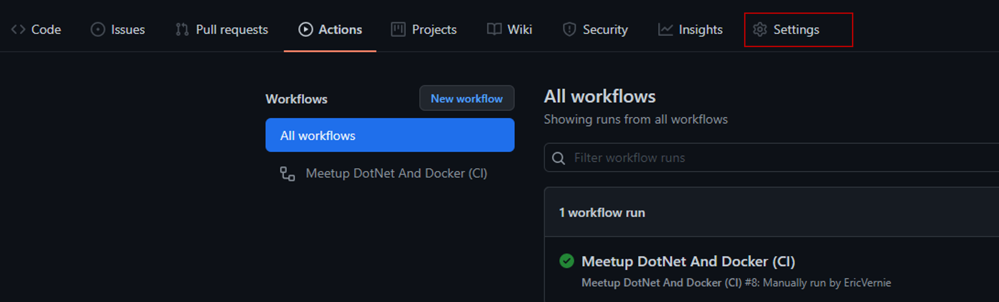

Dans cet article nous allons aborder la création d'une application console [.NET 5](https://docs.microsoft.com/fr-fr/dotnet/fundamentals/), la containeuriser avec [Docker](https://docs.docker.com/) et la déployer sur [Azure](https://docs.microsoft.com/fr-fr/azure) à l'aide des [actions Github](https://docs.github.com/en/actions)


# Préparation du poste de developpement (Windows 10)

Notre poste de développement se base sur un OS Windows Version **10.0.19041.1165**, vous pouvez bien évidement utiliser d'autres OS.

1. [Installez le sous système linux sur Windows (**WSL**).](https://docs.microsoft.com/fr-fr/windows/wsl/install-win10)

2. [Installez le **Kit de développement .NET 5**.](https://docs.microsoft.com/fr-fr/dotnet/core/install/windows?tabs=net50)

2. [Installez **.NET sur linux**.](https://docs.microsoft.com/fr-fr/dotnet/core/install/linux)

    > **Remarque** : Si vous souhaitez **seulement tester sur linux**, vous pouvez n'installer que le runtime .NET 5 sous linux et non pas l'intégralité du SDK.

3. [Installez **Visual Studio Code**.](https://code.visualstudio.com/) (Optionnel)

4. [Installez Git pour Windows](https://git-scm.com/download/win)

5. [Installez **Docker Desktop sur Windows**.](https://docs.docker.com/desktop/windows/install/)

6. [Installez l'outil **az cli**.](https://docs.microsoft.com/fr-fr/cli/azure/install-azure-cli-windows?tabs=azure-cli)

7. [Installez **Windows Terminal**.](https://docs.microsoft.com/fr-fr/windows/terminal/get-started) (Optionnel)


# Abonnement Azure et Github (Optionnel)

Si vous souhaitez tester le déploiement et l'intégration continue, il vous faut :

- Un compte Azure : [Compte Gratuit](https://azure.microsoft.com/fr-fr/free/)

- Un compte Github : [Compte Gratuit](https://github.com/)

# Etape 1 : Création d'une application console .NET 5

- Vérification de la version de .NET :

  ```bash
  dotnet --version
  5.0.400
  ```

  ```bash
  dotnet --info
  SDK .NET (reflétant tous les fichiers global.json) :
  Version:   5.0.400
  Commit:    d61950f9bf
  Environnement :
  OS Name:     Windows
  OS Version:  10.0.19043
  OS Platform: Windows
  RID:         win10-x64
  Base Path:   C:\Program Files\dotnet\sdk\5.0.400\
  ...
  ```

- List des modèles disponibles :

  ```bash
  dotnet new --list
  
  ```

  |Nom du modèle|  Nom court |  Langue |   Balises|
  |--|--|--|--|
  |Console Application|                           console              |[C#],F#,VB | Common/Console|
  |Class library|                                 classlib       |      [C#],F#,VB | Common/Library|
  |...|...|      ... | ...|
  |ASP.NET Core Web API|                          webapi               |[C#],F# |    Web/WebAPI|
  |ASP.NET Core gRPC Service                     grpc                | [C#]        |Web/gRPC|
  |...|...|      ... | ...|
  

Nous allons utiliser ici le modèle **console** de la manière suivante : 

1. Créez un repertoire **dotnetanddocker** (en minuscule) et positionnez vous dans ce répertoire :

    ```bash
    cd dotnetdocker
    ```
    >**Remarque :** Toutes les instructions qui vont suivre seront relativent à ce répertoire.

2. Créez l’application console :

    ```bash
    dotnet new console -f net5.0 -o app -n dotnetanddocker
    ```

    Cette commande créée une application console net5 nommée **dotnetanddocker** dans le répertoire **.\app**

3. Ouvrez le code dans VS Code (ou dans tout autres éditeurs):

    ```bash
    code  .
    ```

4. Ajoutez les lignes suivantes dans le fichier **program.cs** :

    ```CSHARP
    Console.WriteLine(System.Environment.OSVersion);
    Console.WriteLine("Entrez pour terminer le programme");
    Console.Read();
    ```
    L'instruction _Console.WriteLine(System.Environment.OSVersion)_ nous permettra de vérifier l'os sur lequel tourne l'application.

5. Construisez et exécutez l’application :

    ```bash
    dotnet run --project .\app\dotnetanddocker.csproj
    ```


6. Publiez le binaire de l'application console dans le répertoire **.\app\publier**

    ```bash
    dotnet publish -c release ./app/dotnetanddocker.csproj -o ./app/publier

    Microsoft (R) Build Engine version 16.11.0+0538acc04 pour .NET
    Copyright (C) Microsoft Corporation. Tous droits réservés.

    Identification des projets à restaurer...
    Restauration effectuée de C:\dotnetanddocker\app\dotnetanddocker.csproj (en 85 ms).
    dotnetanddocker -> C:\dotnetanddocker\app\bin\release\net5.0\dotnetanddocker.dll
    dotnetanddocker -> C:\dotnetanddocker\app\publier\
    ```

    >Note : Gardez bien à l'esprit le chemin d'accès **./app/publier** que nous utiliserons ultérieurement pour la conteneurisation de l'application.

7. Exécutez l'application

    ```bash
    dotnet .\app\publier\dotnetanddocker.dll
    ```


    Comme vous le voyez sur l'image suivante, l'application console .NET 5 tourne à la fois sur Windows mais aussi sur Linux à partir du même binaire.

    

    -_Exécution de l'application sur Linux et Windows_
    
# Conteneurisation d'une application console .NET 5 avec Docker

La conteneurisation d'une application passe par la génération d'une **image** qui contiendra tous les élèments nécessaires pour que l'application fonctionne.

Pour générer cette image, il nous faut un fichier texte (en régle générale nommé **Dockerfile**). C'est comme un script de commandes qui contient des instructions, sur l'image de base à utiliser, l'installation de l'application etc.  jusqu’à obtenir l’environnement de travail dont vous avez besoin.

Pour une introduction aux conteneurs docker avec .NET 5, [cliquez ici](https://docs.microsoft.com/fr-fr/dotnet/architecture/microservices/container-docker-introduction/)


## Création du fichier Dockerfile.

    FROM mcr.microsoft.com/dotnet/runtime:5.0

    COPY /app/publier /app

    WORKDIR /app

    ENTRYPOINT [ "dotnet","dotnetandocker.dll" ]

Ici notre fichier Dockerfile est simplifié au maximum, il contient les instructions suivantes :

- L'image de base du runtime .NET 5 à utiliser dans notre image.

  **FROM mcr.microsoft.com/dotnet/runtime:5.0**

- La copie des binaires de l'application se trouvant sur le poste local dans le répertoire **/app/publier**, vers le répertoire **/app** qui sera crée lors de la copie).

  **COPY /app/publier /app**

- L'instruction qui permet de se positionner dans le répertoire **/app** avant l'exécution des instructions qui suivent.

  **WORKDIR /app**

- L'instruction pour exécuter l'application console.

  
  **ENTRYPOINT [ "dotnet","dotnetandocker.dll" ]**

  Reportez-vous à la [documentation officielle Docker](https://docs.docker.com/engine/reference/builder/), pour de plus amples informations.

## Génération de l'image

- Pour construire l'image il faut utiliser l'instruction **docker build** de la manière suivante :

  ```bash
  docker build --tag dotnetanddocker:1.0.0 --file ./app/Dockerfile .
  ```

  |Option|Argument|Description|
  |--|--|--|
  |--tag|dotnetanddocker:1.0.0|Nom de l'image avec ça balise.|
  |--file|./app/Dockerfile|Chemin du fichier Dockerfile.|
  ||**.**|Contexte d'exécution de la génération de l'image. Le point (.) signifie que le répertoire courant dans  notre exemple **c:\dotnetdocker**, sera la racine d'exécution de la génération de l'image. Ceci aura une **incidence capitale** dans notre fichier Dockerfile, sur l'instruction de copie des binaires de l'application ou nous précisons d'aller les chercher sur **/app/publier**. Plus d'info [ici](https://docs.docker.com/engine/reference/commandline/build/)|


  
        
  -_Génération d'une image Linux_

- Lister les images sur le poste local.
  ```bash
  docker images
  ```

  |REPOSITORY|TAG|IMAGE ID|       CREATED |        SIZE|
  |--|--|--|--|--|
  |dotnetanddocker |  1.0.0     |   71457a3d3799|   2 minutes ago|   186MB|

- Exécutez l'application

  ```bash
  Docker run --rm -it dotnetanddocker:1.0.0
  ```

  
  -_Exécution d'un conteneur Linux_

  Lors de l'exécution de cette commande, un **conteneur** est crée.
  |Option|Description|
  |--|--|
  |--rm|Supprime le conteneur automatiquement à la fin de son exécution.|
  |-i|Exécute le conteneur en mode interactif. Cela permet au conteneur de ne pas s'arrêter automatiquement.|
  |dotnetanddocker:1.0.0| Image de base utilisée pour la création du conteneur.|

- Exécutez la commande suivante, pour lister les conteneurs en cours d'exécution.
  ```bash
  Docker ps
  ```
  |conteneur ID  |     IMAGE    | COMMAND  | CREATED |   STATUS |PORTS| NAMES|
  |---|---|---|---|---|---|---|
  f7d60abdf162 |  dotnetanddocker:1.0.0|   "dotnet DotNetAndDoc…"  | About a minute ago  | Up About a minute          |  | modest_lalande


## Génération d'une image et d'un conteneur pour Windows

Pour créer une image et un conteneur Windows, il faut basculer Docker pour qu'il utilise Windows, comme illustré sur l'image suivante.

- Bascule Docker sur les conteneurs Windows

  

  -_Basculement sur les conteneurs Windows_

- Listez les conteneurs disponibles : 
  ```bash
    docker images
  ```
  Logiquement la liste est vide.

  |REPOSITORY|TAG|IMAGE ID|       CREATED |        SIZE|
    |--|--|--|--|--|


- Ensuite, pour générer une image docker,  il suffit d'exécuter les mêmes commandes que précedement.

  ```bash
   docker build --tag dotnetanddocker:1.0.0 --file ./app/Dockerfile .

  docker run --rm -i dotnetanddocker:1.0.0

  ```


  
  -_Exécution d'un conteneur Windows_

## Se connecter à un conteneur

Parfois il est nécessaire d'aller vérifier directement dans le conteneur si tous les élèments nécessaire ont bien été copiés, installés etc. Pour cela il est possible d'exécuter un shell de commande en mode interactif.


1. Tout d'abord il faut lister conteneurs encours d'exécution pour récupèrer leur ID.

    ```bash
    docker ps
    ```
  >**Note:** L'instruction **docker ps --all** permet de lister tous les conteneurs, y compris ceux qui sont arrêtés.


  |conteneur ID  |     IMAGE    | COMMAND  | CREATED |   STATUS |PORTS| NAMES|
  |---|---|---|---|---|---|---|
  |f7d60abdf162 |  dotnetanddocker:v1|   "dotnet DotNetAndDoc…"  | About a minute ago  | Up About a minute          |  | modest_lalande

2. Ensuite il suffit d'exécuter la commande suivante : 

    ```bash
      docker exec -it [conteneur ID] bash (Linux)
      
      ou

      docker exec -it [conteneur ID] cmd (Windows)
    ```
    Exécute le shell bash ou cmd dans le conteneur en mode interactif.

    
    _Connection au conteneur Linux_

    
    _Connection au conteneur Windows_

    Vous remarquerez que par défaut nous nous positionons dans le répertoire **/app** ou a été copié les binaires de notre application console.


# Automatiser le déploiement sur Azure avec Github Action (Optionel)

1. Tout d'abord il vous faut créer un nouveau repo dans Github. https://docs.github.com/en/get-started/quickstart/create-a-repo


2. Positionnez vous dans le répertoire **dotnetanddocker** et exécutez les commandes suivantes :

    ```bash

      git init

      git add .

      git commit -m "Commit Initial"

    ```
    >**Note:** avant d'exécuter la commande **git add .**, il serait de bon ton de supprimer les répertoires ./app/obj, ./app/bin, ./app/publier pour éviter de les ajouter au commit initial, sinon vous pouvez ajouter le fichier .gitignore qui se trouve dans ce repos.

3. Ajoutez le repo distant github au repo local et poussez les modifications sur le repo github.

    ```bash
      
      git remote add origin https://github.com/[user]/[repo].git

      git branch -M main

      git push -u origin main

    ```
    Remplacez [user] et [repo] par votre nom github et le nom du repo que vous avez donné à l'étape 1.


4. Sur le poste local exécutez les commandes suivantes

    ```bash
    az login

    az account set --subscription [SUBSCRIPTION ID]

    #Création du groupe de ressource 

    az group create -g [NOM DU GROUPE DE RESSOURCES]  -l "Francecentral"

    #Création du registre de conteneurs azure

    az acr create --name [NOM DU REGISTRE] --resource-group [NOM DU GROUPE DE RESSOURCES]  --sku Basic --admin-enabled true --output none

    #Récupère le mot de passe 

    az acr credential show --resource-group [NOM DU GROUPE DE RESSOURCES]  --name [NOM DU REGISTRE]  --query passwords[0].value --output tsv

    H96viJEVr......

    ```
      **Remplacez les variables** entre crochets par vos propres noms.

      **Copiez le mot de passe**, nous le réutiliserons plus tard en tant que secret avec les actions Github.
      

5. Création d'un principal de service et l'ajouter comme contributeur au groupe de ressources **[NOM DU GROUPE DE RESSOURCES]**

    ```

    az ad sp create-for-rbac --name [NOM DU PRINCIPAL DE SERVICE] --sdk-auth --role contributor --scopes /subscriptions/{subscription-id}/resourceGroups/[NOM DU GROUPE DE RESSOURCES]

    ```

    L'option **--sdk-auth**, permet de récupèrer en sortie les informations de login (au format json) que nous réutiliserons par la suite dans Github Action en tant que secret.

    ```JSON
    {
    "clientId": [GUID],
    "clientSecret": [GUID],
    "subscriptionId": [GUID],
    "tenantId": [GUID],
    ...
    }
    ```
    Copiez le JSON, nous le réutiliserons plus tard avec les actions Github.

6. Sur Github, sélectionnez **Actions**

    

7. Choisir le modèle **Docker Image** comme point de départ.

    

8. Remplacez par le code Yaml suivant :

    ```YAML
    name: Meetup DotNet And Docker 
    on:
      workflow_dispatch: 
    env:
      RG_NAME: [NOM DU GROUPE DE RESSOURCES]
      ACR_NAME: [NOM DU REGISTRE]
      IMAGE_NAME: dotnetanddocker
      ACR_SERVER: [NOM DU REGISTRE].azurecr.io

    jobs:

      build:

        runs-on: ubuntu-latest  
        
        steps:

        - uses: actions/checkout@v2   
        - name:  Récupère .NET
          uses: actions/setup-dotnet@v1 
          with:
              dotnet-version: 5.0.x            
        - name: Publier le code source
          run:  
            dotnet publish -c release ./app/dotnetanddocker.csproj -o ./app/publier      
        - name: Tester le code
          run:  | 
                echo "Il faudrait tester le code !!"            
        - name: Connexion à Azure conteneur Registry
          uses: docker/login-action@v1.10.0
          with:
            registry: ${{ env.ACR_SERVER }}
            username: ${{ env.ACR_NAME }}
            password: ${{ secrets.PASSREGISTRY }}
        - name: Extraire les métadonnées docker
          id: meta
          uses: docker/metadata-action@v3.5.0
          with:
            images: ${{ env.ACR_SERVER }}/${{ env.IMAGE_NAME }} 
            tags: |
            type=semver,pattern={{version}},value=v1.0.0
            
        - name: Construire et pousser image Docker
          uses: docker/build-push-action@v2.7.0
          with:         
              context: ./
              file: ./app/Dockerfile
              push: true
              tags: ${{ steps.meta.outputs.tags }}
              labels: ${{ steps.meta.outputs.labels }}
        - name: Image digest
          run: echo ${{ steps.docker_build.outputs.digest }}   
        
    ```

    **Remplacez les variables** entre crochets par vos propres noms

    Ensuite StartCommit...


9. Sur Github ajoutez en tant que secret les informations de login à Azure.

    - Settings
      
    - New Repository secret
      
    - Nom du secret : AZURE_CREDENTIALS

    - Copiez le json obtenu plus haut
      


10. De la même manière, vous allez ajouter le secret correspondant au mot de passe du registre de conteneurs Azure.

   - Nom du secret : PASSREGISTRY

      **Collez le mot de passe** du registre de conteneurs Azure.


11. Démarrez le Workflow manuellement

    

    Les étapes contenues dans le fichier yaml s'éxecute une à une jusqu'au déploiement de l'image sur Azure.

    

12. Vérifiez sur [le portail Azure](https://portal.azure.com) que l'image **dotnetanddocker** est bien présente.

    

13. Testez l'application.
    
    13.1 Se connecter au registre de conteneur Azure.
    ```bash
    docker login  [NOM DU REGISTRE].azurecr.io -u [NOM DU REGISTRE] -p [MOT DE PASSE DU REGISTRE]
    ```

    13.2 Exécutez l'application.

    ```bash
    docker run -it [NOM DU REGISTRE].azurecr.io/dotnetanddocker:1.0.0 

    ```
    

    Si l'image n'est pas présente sur le poste, elle se télécharge avant d'exécuter le conteneur.